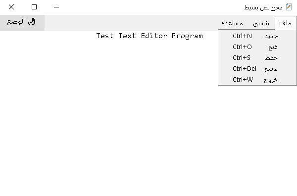
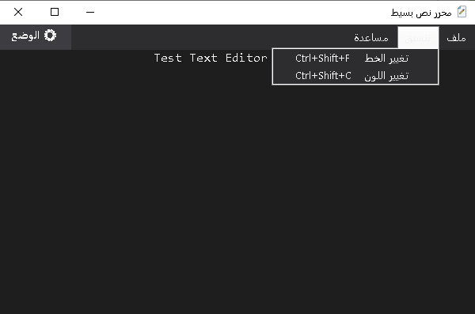
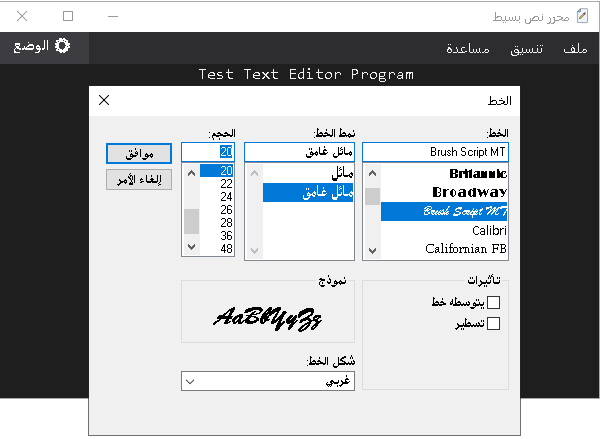
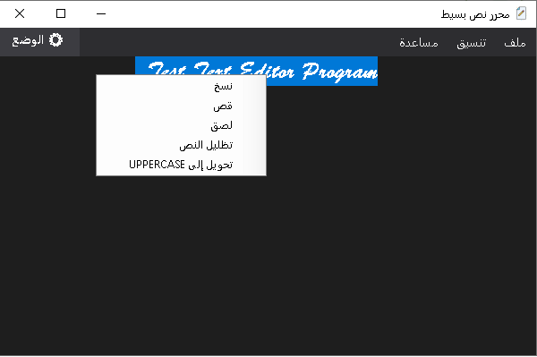

# Simple Text Editor 

A modern, lightweight, and user-friendly desktop text editor built with **C#** and **Windows Forms (.NET Framework 4.8)**. Designed for smooth note-taking and editing with full support for dark/light themes, text formatting, contextual menus, and essential file management operations.

---

## 📁 Project Structure

```text
Simple Text Editor/
├── docs/
├── screenshots/
│   ├── light-mode.png
│   ├── dark-mode.png
│   ├── font-dialog.png
│   └── context-menu.png
├── App.config
├── AppIcon.ico
├── Form1.cs
├── Form1.Designer.cs
├── Form1.resx
├── Program.cs
├── README.md
├── Simple Text Editor Project.csproj
└── Simple Text Editor Project.sln
```

---

## 📸 Screenshots

| Light Theme | Dark Theme |
| :---: | :---: |
|  |  |

| Font & Color Dialog | Context Menu |
| :---: | :---: |
|  |  |

---

## ✨ Key Features

### 📄 File Operations
* **New Document (`Ctrl + N`):** Quickly clear the workspace to start a new document.
* **Open File (`Ctrl + O`):** Load existing `.txt` files directly into the editor using `OpenFileDialog`.
* **Save File (`Ctrl + S`):** Save current text content using `SaveFileDialog`.
* **Clear Canvas (`Ctrl + Delete`):** Instantly wipe text content.
* **Exit Application (`Ctrl + W`):** Clean application termination.

### 🎨 Text Formatting & Customization
* **Font Selection (`Ctrl + Shift + F`):** Change font style, size, and weight using standard Windows `FontDialog`.
* **Text Color (`Ctrl + Shift + C`):** Pick custom text colors using `ColorDialog`.
* **Text Highlight:** Highlight selected text with a yellow background.
* **Case Conversion:** Convert selected text to **UPPERCASE** via right-click menu.

### 🌗 Themes & UI/UX
* **Dynamic Dark/Light Mode:** One-click toggle switching UI background, text color, and menu bar palette between Dark Charcoal and Light themes.
* **Context Menu:** Native right-click menu for quick access to Cut, Copy, Paste, Highlight, and Uppercase operations.
* **RTL & Multilingual Friendly:** Configured for seamless Right-to-Left and Left-to-Right layout rendering.

---

## ⌨️ Keyboard Shortcuts

| Feature | Shortcut |
| :--- | :--- |
| **New File** | `Ctrl + N` |
| **Open File** | `Ctrl + O` |
| **Save File** | `Ctrl + S` |
| **Clear Text** | `Ctrl + Delete` |
| **Exit** | `Ctrl + W` |
| **Change Font** | `Ctrl + Shift + F` |
| **Change Color** | `Ctrl + Shift + C` |
| **About Program** | `F1` |

---

## 🛠️ Tech Stack & Requirements

* **Language:** C#
* **Framework:** .NET Framework 4.8
* **UI Technology:** Windows Forms (WinForms)
* **IDE:** Visual Studio 2022 / 2026
* **Key Components:** `RichTextBox`, `MenuStrip`, `ContextMenuStrip`, `FontDialog`, `ColorDialog`, `OpenFileDialog`, `SaveFileDialog`

---

## 🚀 Getting Started

### Prerequisites
To build and run this project, make sure you have:
* [Visual Studio](https://visualstudio.microsoft.com/) with **.NET desktop development** workload installed.
* **.NET Framework 4.8** or higher.

### Installation & Execution
1. **Clone the repository:**
   ```bash
   git clone https://github.com/Abdullah-Shalgam/simple-text-editor-project.git
   ```
2. **Open the project:**
   Double-click `Simple Text Editor Project.slnx` to open it in Visual Studio.
3. **Build & Run:**
   Press `F5` or click the **Start** button in Visual Studio.

---

## 📬 Contact & Developer Info

[](https://github.com/Abdullah-Shalgam)
[](https://www.linkedin.com/in/%D8%B9%D8%A8%D8%AF%D8%A7%D9%84%D9%84%D9%87-%D8%B4%D9%84%D8%BA%D9%88%D9%85-289506438)
[](https://instagram.com/abdullah_shalgam)
[](https://wa.me/2180931364346)
[](mailto:bdallhshlghwm500@gmail.com)

---

## 📝 License

Distributed under the MIT License. See `LICENSE` for more information.
